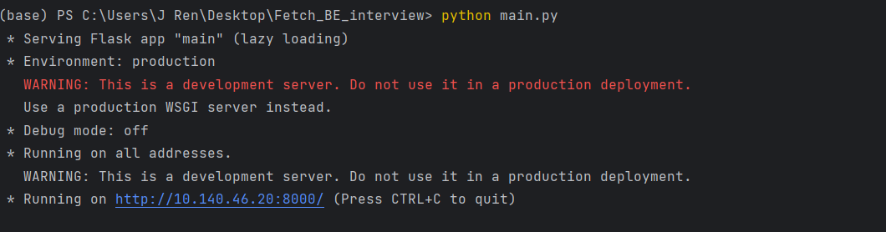

# Fetch BackEnd Interview Project

## Running the Application

To execute this application, please follow the steps outlined below:

```bash
# 1. Install Required Python Libraries
pip install -r requirements.txt

# 2. Run the Application
python3 main.py

```

Upon successful execution, the application will display an image in your command line, as depicted below:



The lower section of the displayed image contains the IP address that you can utilize for testing the provided APIs.

